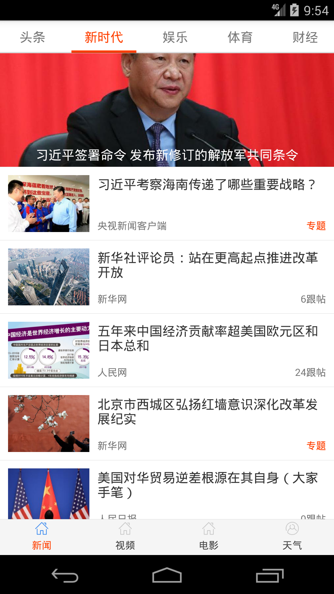
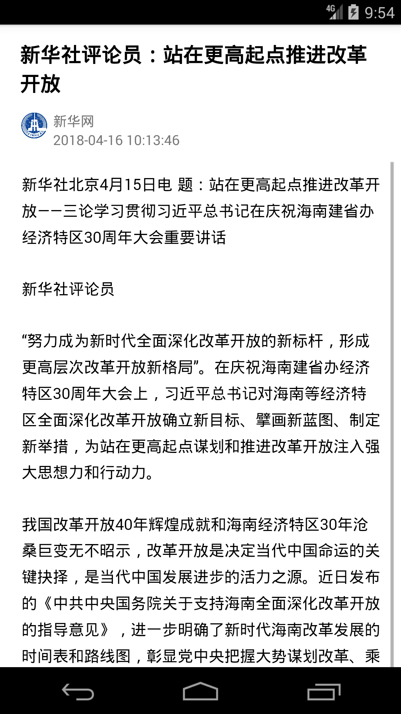
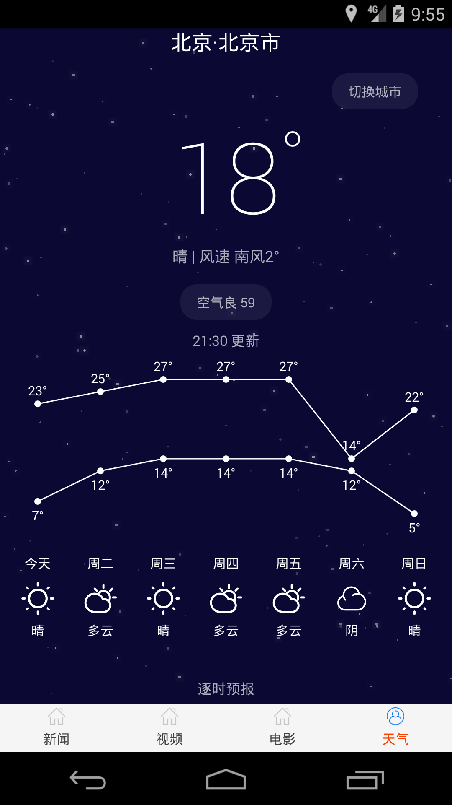

项目介绍：
知趣，基于MVP＋RxJava＋Retrofit＋Picasso＋ARouter框架实现的一款集新闻、视频、电影与天气于一体的App，分module开发，最后利用阿里开源ARouter合并，目前基本功能已经实现。依然有许多待完善。

运行截图：

另：本项目所有数据来源均为charles截取，不做任何商业用途。

charles截取可参考https://www.jianshu.com/p/235bc6c3ca77
